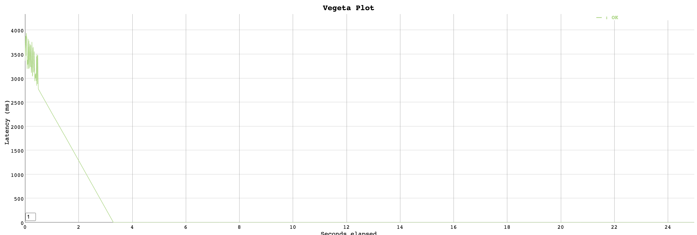

[](https://goreportcard.com/report/github.com/chen-keinan/npm-dep-tree)
[](https://github.com/chen-keinan/beacon/blob/main/LICENSE)

[](https://gitter.im/beacon-sec/community?utm_source=badge&utm_medium=badge&utm_campaign=pr-badge)

<br><br>
# npm package dependency resolver

High performance npm package dependencies resolver and print out it dependency tree

* [Installation](#installation)
* [Usage](#Usage)
* [Benchmark](#benchmark)
* [Performance Plot](#performance-plot)

## Installation

```shell
# git clone git@github.com:chen-keinan/npm-dep-tree.git
# make build
#./npm-dep-tree
```

## Usage

```shell
curl http://localhost:8085/api/v1/package-dependencies/file-loader/6.2.0

└ file-loader:6.2.0
    ├ loader-utils:2.0.0
    │ ├ big.js:5.2.2
    │ ├ emojis-list:3.0.0
    │ └ json5:2.1.2
    │   └ minimist:1.2.5
    └ schema-utils:3.0.0
      ├ ajv-keywords:3.5.2
      ├ @types
      │ └ json-schema:7.0.6
      └ ajv:6.12.5
        ├ json-schema-traverse:0.4.1
        ├ uri-js:4.2.2
        │ └ punycode:2.1.0
        ├ fast-deep-equal:3.1.1
        └ fast-json-stable-stringify:2.0.0
```

### Benchmark

```
Requests      [total, rate, throughput]         2500, 100.04, 100.04
Duration      [total, attack, wait]             24.991s, 24.99s, 922.548µs
Latencies     [min, mean, 50, 90, 95, 99, max]  267.77µs, 156.715ms, 694.22µs, 250.327ms, 1.489s, 2.725s, 3.465s
Bytes In      [total, mean]                     1182190, 472.88
Bytes Out     [total, mean]                     0, 0.00
Success       [ratio]                           100.00%
Status Codes  [code:count]                      200:2500
```

### Vegeta Performance Plot

<br><br>
